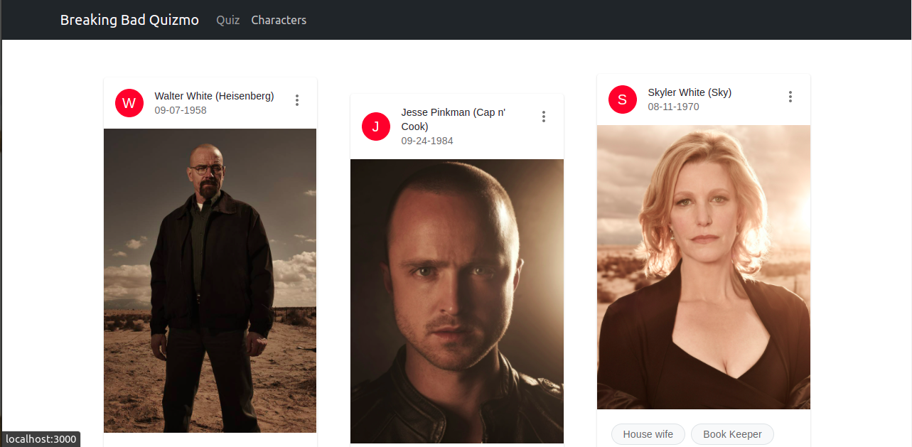
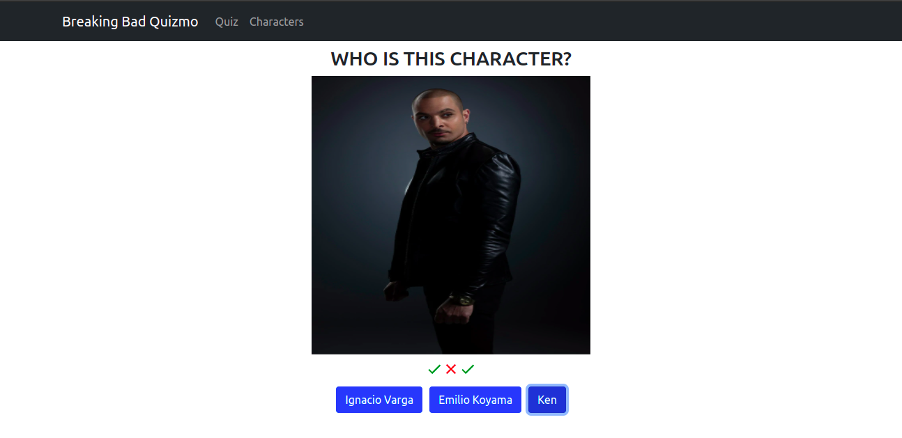

# Breaking Bad Quizmo

> A fun app for Breaking Bad fans to know and test their knowledge of the characters.





 Breaking Bad fans and movie lovers can learn more about the characters of the movie and test their knowledge with the quiz functionality.


## Built With

- React v17.0.2
- Redux v4.1.2
- react-bootstrap v1.7.2
- react-router-dom v6.2.1
- react-redux v7.2.6
- Material UI/Icons


## Getting Started

To get a local copy, run the following commands:
```
git clone https://github.com/francisuloko/breaking-bad-quizmo.git

cd breaking-bad-quiz
```


To get started, run the following commands to get started:

```
npm install
npm start
```

## API ENDPOINT
1. Base Url: `https://www.breakingbadapi.com/`
2. Get Characters: `/api/characters/`

## Authors

👤 **Francis Uloko**

- [Github](https://github.com/francisuloko)
- [Twitter](https://twitter.com/francisuloko)
- [LinkedIn](https://linkedin.com/in/francisuloko)

## 🤝 Contributing

Contributions, issues and feature requests are welcome!

Feel free to check the [issues page](https://github.com/francisuloko/breaking-bad-quiz/issues).

## Show your support

Give a ⭐️ if you like this project!

## Acknowledgments

1. Inkredo
2. [Breaking Bad API](https://breakingbadapi.com/documentation)
3. [Maerics](https://stackoverflow.com/a/17891411)

## 📝 License

This project is [MIT](https://mit-license.org) licensed.
